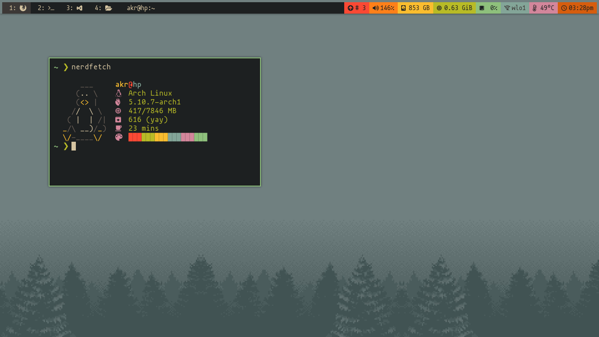
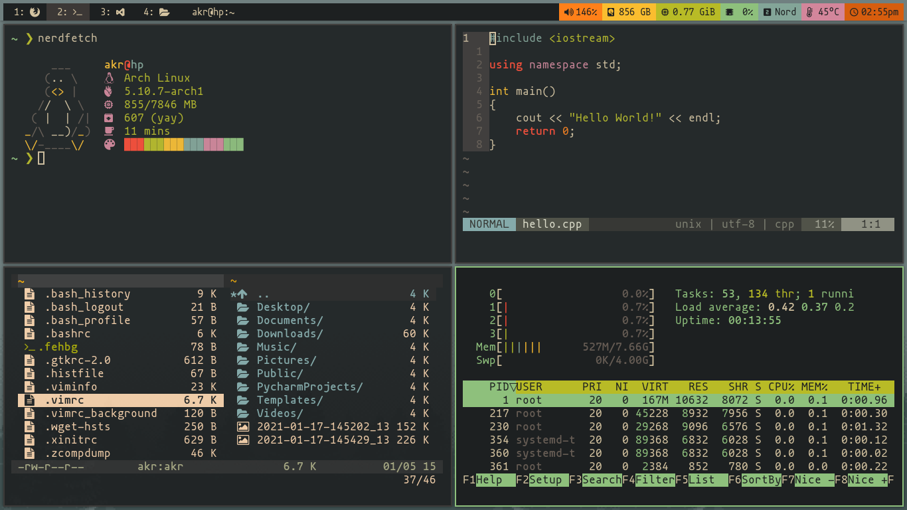

<h1 align="center">dotfiles</h1>

  The configuration files for my Arch Linux rice based on Gruvbox Dark theme.

+ __font:__ [mononoki-nerd-font](https://aur.archlinux.org/packages/nerd-fonts-mononoki/)
+ __launcher:__ [rofi](https://github.com/davatorium/rofi)
+ __terminal:__ [alacritty](https://github.com/alacritty/alacritty)
+ __shell:__ zsh + [oh-my-zsh](https://github.com/ohmyzsh/ohmyzsh)
+ __prompt:__ [starship](https://starship.rs/)
+ __bar:__ [polybar](https://github.com/polybar/polybar)
+ __browser:__ firefox

## Preview

### Credits
+ __DistroTube:__ [youtube](https://www.youtube.com/channel/UCVls1GmFKf6WlTraIb_IaJg), [gitlab](https://gitlab.com/dwt1)
+ __Ermanno Ferrari:__ [youtube](https://www.youtube.com/channel/UCX_WM2O-X96URC5n66G-hvw), [website](https://ermannoferrari.net/)
+ __Luke Smith:__ [youtube](https://www.youtube.com/channel/UC2eYFnH61tmytImy1mTYvhA), [github](https://github.com/LukeSmithxyz)
